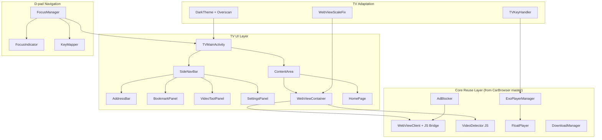
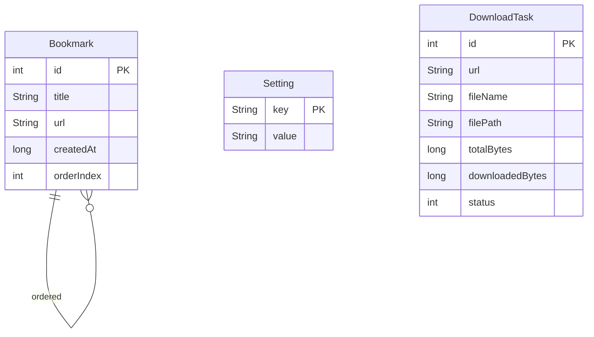

# 架构设计 — LazyLines Browser for Projector

> 阶段3产出 | 日期：2026-05-11

## 1. 系统架构图



## 2. 模块设计

### M01：TV适配基础

- **职责**：Manifest声明（LEANBACK_LAUNCHER、no-touchscreen）、暗色主题定义、Overscan安全边距、TV Banner资源
- **输入**：Android系统回调（onCreate/onWindowFocusChanged）
- **输出**：配置好的Activity窗口（安全边距padding、暗色背景）
- **核心逻辑**：Activity.setPadding()实现overscan安全区；Theme继承Leanback主题覆盖暗色属性

### M02：D-pad导航框架

- **职责**：管理焦点流转、焦点视觉反馈、导航栏/内容区切换、遥控器按键映射
- **输入**：KeyEvent（DPAD_UP/DOWN/LEFT/RIGHT/ENTER/BACK）
- **输出**：焦点转移指令、区域切换事件
- **核心逻辑**：
  - FocusManager维护两个焦点区域：navZone（侧边栏）和contentZone（WebView）
  - DPAD_LEFT/RIGHT在两个zone间切换，DPAD_UP/DOWN在zone内移动
  - WebView内部焦点不拦截，靠scroll处理上下浏览
  - 焦点变化时触发FocusIndicator动画

### M03：TV UI层

- **职责**：侧边导航栏、首页布局、地址栏、书签面板、视频工具弹窗、设置面板
- **输入**：用户D-pad操作、FocusManager焦点事件
- **输出**：URL加载请求、书签CRUD、设置变更
- **核心逻辑**：所有面板为Fragment，通过SideNavBar切换显示；每个可聚焦View设置focusable=true和focusableInTouchMode=true

### M04：WebView适配

- **职责**：修复TV WebView分辨率、设置TV友好UA、投影阅读模式
- **输入**：WebView初始化回调
- **输出**：正确缩放的WebView实例
- **核心逻辑**：`setInitialScale((dm.densityDpi / 160.0 * 100).toInt())` 修正分辨率；textZoom=130增强可读性

### M05：ExoPlayer TV适配

- **职责**：遥控器控制视频播放（播放/暂停/快进/快退/倍速）、全屏模式
- **输入**：KeyEvent、VideoDetector检测结果
- **输出**：播放控制指令
- **核心逻辑**：OnKeyListener映射DPAD_CENTER→暂停/播放、DPAD_LEFT→快退10s、DPAD_RIGHT→快进10s、长按LEFT/RIGHT→倍速切换

### M06：核心逻辑复用

- **职责**：从CarBrowser master分支直接复用，不修改核心逻辑
- **复用清单**：VideoDetector JS脚本、AdBlocker（EasyList解析+shouldInterceptRequest）、DownloadManager（HttpURLConnection+线程池+SQLite）、CarBridge（JS接口）、SSL容错（onReceivedSslError proceed）

## 3. 接口定义

### 内部接口：FocusManager.OnZoneSwitchListener

```java
interface OnZoneSwitchListener {
    void onZoneSwitched(Zone from, Zone to);  // Zone: NAV / CONTENT
}
```

### 内部接口：FocusManager.OnFocusChangeListener

```java
interface OnFocusChangeListener {
    void onFocusChanged(View focused, Zone zone);
}
```

### 内部接口：TVKeyHandler

```java
interface TVKeyHandler {
    boolean handleKey(KeyEvent event, ExoPlayer player);
    // 返回true表示已消费，false表示未处理
}
```

## 4. 数据模型

本项目无服务端，仅本地数据：



| 字段名 | 类型 | 约束 | 说明 |
|--------|------|------|------|
| Bookmark.id | int | PK AUTO | 自增主键 |
| Bookmark.url | String | NN | 书签URL |
| Setting.key | String | PK | 如 adblock_enabled, search_engine, overscan_percent |
| Setting.value | String | - | 对应值 |

## 5. 技术栈

| 层级 | 技术选型 | 版本 | 选型理由 |
|------|----------|------|----------|
| 语言 | Java | 8 | 与CarBrowser master保持一致 |
| UI框架 | Android View System | API 21+ | 不引入Compose for TV，Java 8兼容 |
| 主题 | Theme.Leanback | 1.0.0 | Android TV标准暗色主题基类 |
| WebView | Android System WebView | - | Shield TV自带，不可更换 |
| 视频播放 | ExoPlayer | 2.19.x | 与CarBrowser master版本一致 |
| 构建 | Gradle | 7.5 | 与CarBrowser master一致 |
| CI | GitHub Actions | - | 云端构建Debug APK |
| 分发 | 侧载APK | - | 无需Google Play |

## 6. 关键设计决策

| 决策编号 | 问题 | 方案 | 理由 | 备选方案 |
|----------|------|------|------|----------|
| D01 | WebView内D-pad焦点 | 不拦截WebView内部焦点，靠scroll浏览网页 | 网页DOM元素不可控，强行焦点管理会导致跳转混乱 | 注入JS实现网页焦点链（复杂且不可靠） |
| D02 | 导航模式 | 侧边栏+内容区双zone | D-pad左右切换zone最直觉，与Android TV标准交互一致 | 底部Tab栏（浪费纵向空间，投影宽高比2.35:1下更差） |
| D03 | 暗色主题 | 继承Theme.Leanback覆盖自定义属性 | Leanback提供TV标准暗色基础，覆盖即可自定义 | 完全自定义Theme（工作量大且不一致） |
| D04 | Overscan策略 | Activity根布局setPadding | 简单有效，所有子View自动在安全区内 | 每个Fragment独立处理（重复且易遗漏） |
| D05 | 分支策略 | 从master创建projector分支 | 隔离TV适配代码，不影响车机版 | 同分支条件编译（代码混乱） |

---

**评审状态**：⏳ 待评审
**下一动作**：请评审后输入「通过」进入阶段4（前端UI设计）
